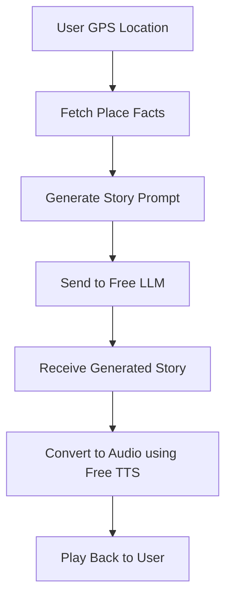

# Lore MVP Build Plan (Free Tools)

## 🎯 Goal
Build an MVP for **Lore**, a hands-free, audio-first infotainment app for road trips, using **free and open-source tools** to deliver:
- Auto-generated, GPS-aware storytelling
- Podcast-style narration with TTS
- Interactive voice trivia

---

## 🧠 1. Story Generation Prompt Templates

### 📄 Template Structure
```text
You are a podcast narrator creating engaging, family-friendly stories for people on road trips.

Context:
- Location: {{location_name}}
- Type of place: {{place_type}}
- Known facts: {{key_facts}}
- Story type: {{tone}}

Instructions:
1. Create a vivid, immersive 2–3 minute story with a strong hook.
2. Use real facts but wrap them in storytelling (dialogue, suspense, "what-if" scenarios).
3. End the story with a trivia question.
4. Keep the language simple and friendly for all ages.

Story:
```

### ✅ Example Inputs
- location_name: Route 66, Arizona
- place_type: Ghost town
- key_facts: "Once a mining town, now abandoned. Rumored to be haunted by old prospectors."
- tone: Spooky

### 🔓 Free LLMs for Prompt Execution
- [OpenRouter.ai](https://openrouter.ai): Mistral, Claude Instant (free tier)
- [Hugging Face Spaces](https://huggingface.co/spaces): Zephyr, Gemma, Phi-3-mini
- [LM Studio](https://lmstudio.ai): Run models like Mistral, LLaMA 3 8B locally

---

## 🎙️ 2. LLM + TTS Orchestration Flow (Free Stack)

### ⚙️ Pipeline Flow


### 📦 Tools per Step
| Step | Tool | Free Tier? |
|------|------|------------|
| 📍 GPS + Map | Mapbox / OpenStreetMap | ✅ |
| 📄 Place Facts | Wikipedia API, Wikidata | ✅ |
| 🧠 Story Gen | OpenRouter.ai, HuggingFace | ✅ |
| 🔊 TTS | [Bark](https://github.com/suno-ai/bark), [Coqui TTS](https://github.com/coqui-ai/TTS) | ✅ |
| 🎧 Audio Player | Flutter / React Native Audio SDKs | ✅ |

---

## 📊 3. Token Usage Estimation (100 Users)

### Assumptions
- Each user listens to 5 stories
- Each story = ~600 tokens (prompt + output)

### Totals
| Metric | Value |
|--------|-------|
| Tokens per user | ~3,000 |
| Total for 100 users | ~300,000 tokens |

### Free Usage Capacity
| Platform | Model | Monthly Free Tokens |
|----------|--------|----------------------|
| OpenRouter.ai | Claude Instant, Mistral | ~2M tokens/month |
| Hugging Face | Various | Shared compute, free |
| LM Studio (local) | Mistral, Gemma, Phi | Unlimited (RAM-limited) |

---

## ✅ MVP Component Overview (Free Resources)
| Feature | Free Tool |
|--------|-----------|
| Story Gen | OpenRouter / HuggingFace |
| Trivia | Same LLM session |
| TTS | Bark / Coqui (local) |
| Data Source | Wikipedia / Wikidata |
| GPS | OpenStreetMap / Mapbox |
| App Dev | Flutter / React Native |

---

## 🔜 Next Steps
- [ ] Generate sample stories with prompt templates
- [ ] Test TTS with Bark/Coqui locally
- [ ] Integrate LLM and TTS in mobile app skeleton
- [ ] Pre-cache content for popular destinations

